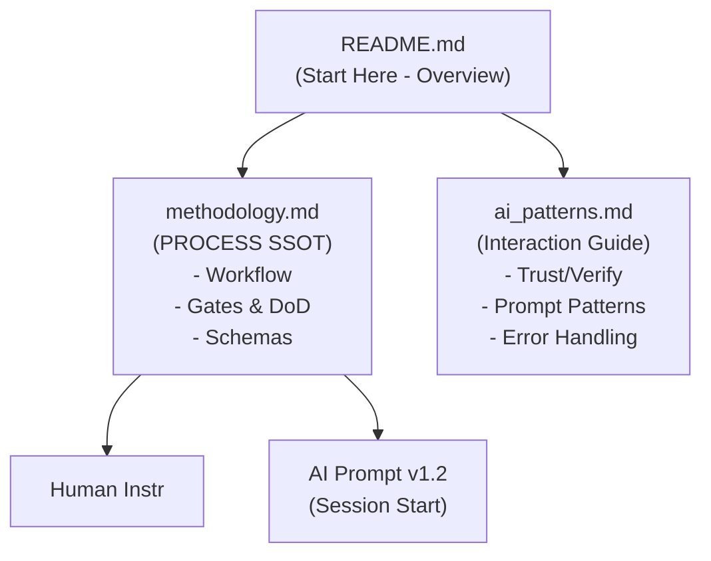
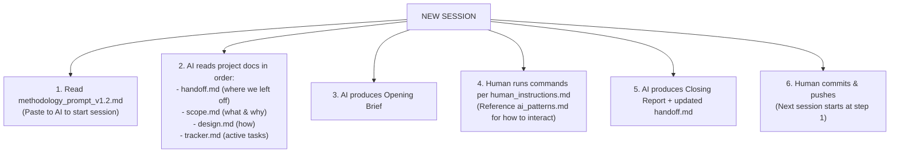
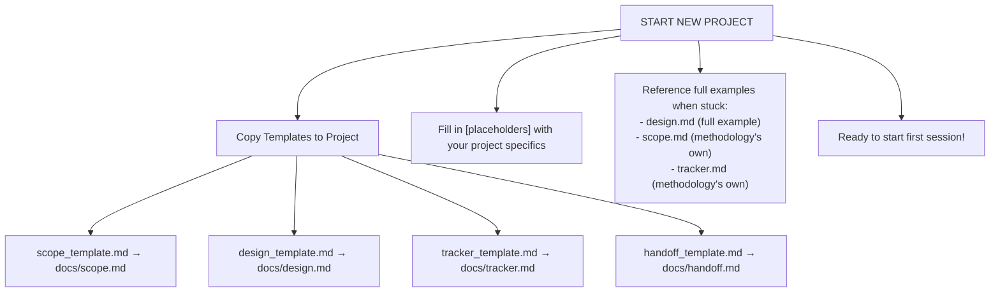
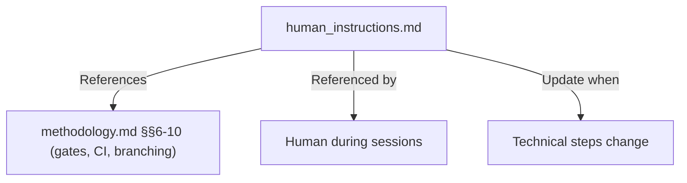
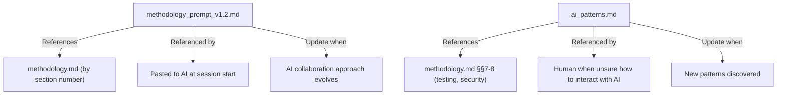
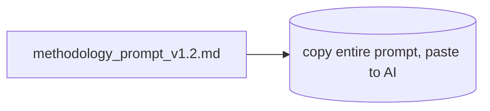
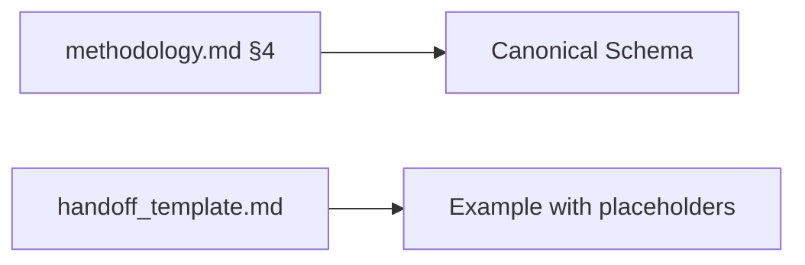

# Methodology Document Relationships

**Visual guide to understanding how all documents connect**

---

## Document Hierarchy



---

## Session Flow



---

## Template → Project Document Flow



---

## Document Dependencies

### Core Process Layer (Methodology)

```mermaid
flowchart TD
  MM["methodology.md (SSOT)"]
  MM --> |"References: No dependencies"| ND[No dependencies]
  MM --> |"Referenced by"| ALL[All other documents]
  MM --> |"Update when"| U1[Process changes (rarely)]
```

### Human Operator Layer



### AI Interaction Layer



### Project Definition Layer

```mermaid
flowchart TD
  SCOPE[scope.md (YOUR PROJECT)]
  DESIGN[design.md (YOUR PROJECT)]
  TRACK[tracker.md (YOUR PROJECT)]
  HANDOFF[handoff.md (YOUR PROJECT)]

  SCOPE --> |"References"| METH4["methodology.md (implicitly follows its principles)"]
  DESIGN --> |"References"| SCOPE2["scope.md (must align with goals)"]
  TRACK --> |"References"| SCOPE3["scope.md (goals)"], DESIGN2["design.md (sections)"]
  HANDOFF --> |"References"| TRACK2["tracker.md (active tasks)"], DESIGN3["decisions from design.md"]
  HANDOFF --> |"Referenced by"| NEXT["Next session's AI prompt"]
```

---

## Reading Order by Role

### New Team Member
```
Day 1:
1. README.md (15 min) ─→ Overview
2. methodology.md (30 min) ─→ Process understanding
3. Project's scope.md (10 min) ─→ What we're building
4. Project's design.md (30 min) ─→ How we're building it

Day 2:
5. human_instructions.md (20 min) ─→ Technical operations
6. ai_patterns.md (30 min) ─→ AI interaction
7. Project's tracker.md (10 min) ─→ Current work
8. Try a small task end-to-end
```

### Starting a Session
```
1. handoff.md ─→ Where we left off (2 min)
2. tracker.md ─→ Active task details (3 min)
3. (If needed) design.md sections relevant to task (5 min)
4. Paste methodology_prompt_v1.2.md to AI
5. Confirm with AI: "What task are we working on?"
```

### Making a Design Decision
```
1. scope.md ─→ Does this align with goals?
2. design.md §8 (ADRs) ─→ Similar past decisions?
3. ai_patterns.md §4 ─→ Use "Multi-Option Analysis" pattern
4. Get AI to show tradeoffs
5. Document as new ADR in design.md
6. Update tracker.md task with decision link
```

---

## Document Update Frequency

| Document | Update Frequency | Owner |
|----------|------------------|-------|
| **methodology.md** | Rarely (process changes) | Dev Lead |
| **human_instructions.md** | Occasionally (tool changes) | DevEx |
| **methodology_prompt_v1.2.md** | Occasionally (prompt improvements) | AI + Dev Lead |
| **ai_patterns.md** | Monthly (new patterns learned) | Team |
| **scope.md** | Quarterly (goals evolve) | Product/Tech Lead |
| **design.md** | Monthly (architecture decisions) | Dev Lead |
| **tracker.md** | Continuously (after every change) | Everyone |
| **handoff.md** | After EVERY session (mandatory) | Session operator |

---

## File Size Reference

| Document | Size | Complexity | Read Time |
|----------|------|------------|-----------|
| README.md | 13 KB | Easy | 15 min |
| methodology.md | 4.8 KB | Medium | 20 min |
| human_instructions.md | 8.4 KB | Medium | 25 min |
| methodology_prompt_v1.2.md | 24 KB | Medium | 30 min |
| ai_patterns.md | 22 KB | Medium | 40 min |
| design_template.md | 23 KB | Easy (fill-in) | 10 min |
| design.md (example) | 26 KB | Complex | 60 min |
| scope_template.md | 7.8 KB | Easy (fill-in) | 10 min |
| tracker_template.md | 7.6 KB | Easy (fill-in) | 10 min |
| handoff_template.md | 865 B | Easy (fill-in) | 5 min |

**Total reading time (all docs):** ~4 hours  
**Minimum to start:** ~1 hour (README + methodology.md + fill templates)

---

## Authority Chain (Conflict Resolution)

```mermaid
flowchart TD
  METHOD[methodology.md (SSOT)]
  SCOPE[scope.md (Project SSOT)]
  DESIGN[design.md (Technical SSOT)]
  TRACKER[tracker.md]

  METHOD --> |"Always wins over"| SCOPE
  METHOD --> |"Always wins over"| DESIGN
  METHOD --> |"Always wins over"| TRACKER

  SCOPE --> |"Wins within project definition over"| DESIGN
  SCOPE --> |"Wins within project definition over"| TRACKER

  DESIGN --> |"Wins for implementation decisions over"| TRACKER

  note_over["Exception: If methodology.md is WRONG, fix methodology.md first,\nthen cascade changes to other docs."]:::note
  classDef note fill:#fff4cc,stroke:#e6c200

  METHOD -.-> note_over
```

---

## Common Navigation Paths

### "How do I start a session?"



### "What's the exact handoff format?"



### "How do I know when I'm done?"

```
methodology.md §6 → Definition of Done
    ↓
Check all DoD items:
    ├─→ Lints clean?
    ├─→ Tests pass?
    ├─→ Coverage ≥80%?
    ├─→ Security clean?
    ├─→ Docs updated?
    └─→ PR checklist done?
```

### "AI made a mistake, what do I do?"

```
ai_patterns.md §6 → Handling AI Mistakes
    ↓
5-step recovery protocol:
    1. Identify mistakea
    2. Request explanation
    3. Get correction
    4. Verify fix
    5. Add prevention test
```

...

**End of Document Relationships Guide**

This visual guide helps you navigate the 11 methodology documents.
Keep this handy as a reference map!
